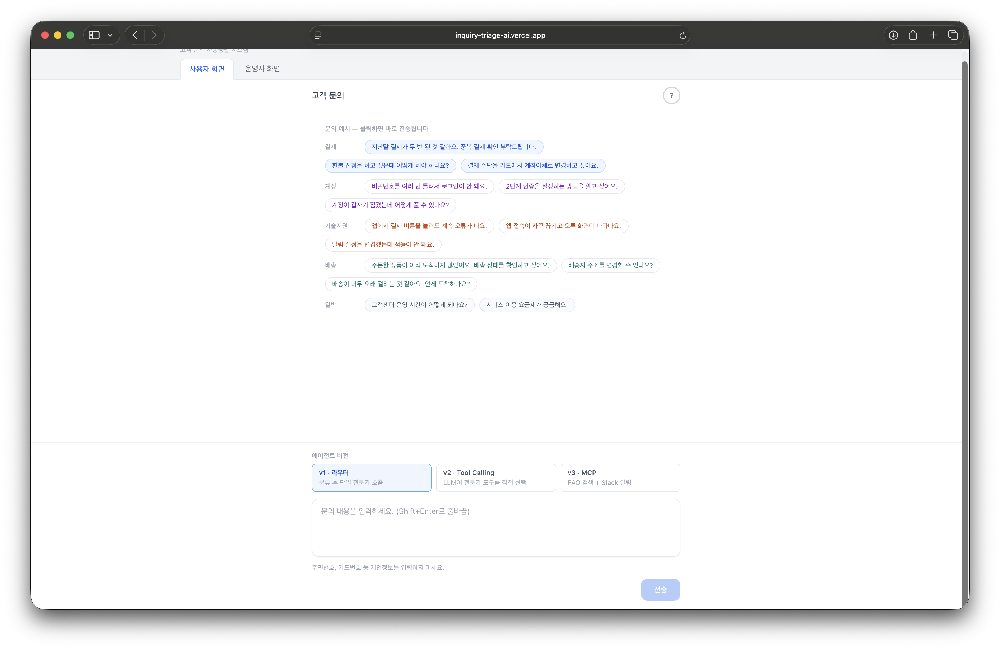
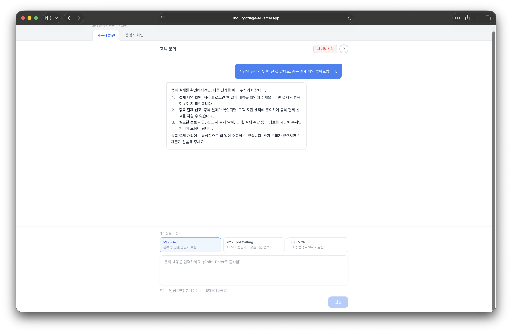
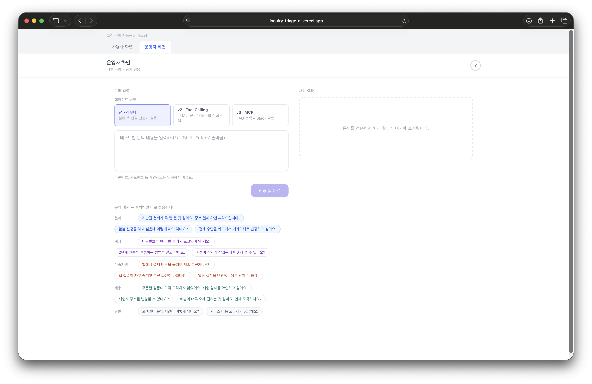
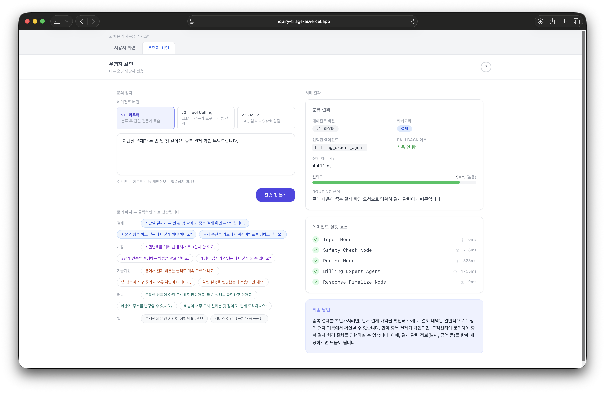

# Inquiry Triage AI

LangChain + LangGraph 기반 멀티 에이전트 고객 문의 분류 및 답변 생성 시스템.

고객 문의를 자동으로 분류하여 전문 에이전트가 답변을 생성하고, 운영자는 처리 과정의 메타데이터를 실시간으로 확인할 수 있습니다.

---

## 스크린샷

**고객 화면 (User Mode)** — 문의를 입력하면 최종 답변만 표시



**운영자 화면 (Operator Mode)** — 분류 카테고리, 신뢰도, 실행 트레이스 등 내부 메타데이터 표시



---

## 프로젝트 배경

업에서 공통적으로 필요하면서 LLM을 효과적으로 적용할 수 있는 도메인을 고민하다 고객 지원에 주목했습니다. 현재 대부분의 고객센터 챗봇은 버튼 선택형 응답이나 FAQ 검색 형태로, 고객이 자신의 문의를 정해진 선택지에 맞춰야 합니다. 이 방식은 문의 유형이 선택지를 벗어나거나 맥락이 복잡해지면 결국 상담원 연결로 끝나는 경우가 많습니다. LLM을 활용하면 자유로운 자연어 문의를 받아 분류부터 답변 생성까지 처리할 수 있고, 이 과정을 안정적으로 제어하기 위해 LangGraph 기반 멀티 에이전트 구조를 설계했습니다.

---

## 아키텍처

```
고객 문의 입력
    │
    ▼
input_node
    │
    ▼
safety_check_node ──(위반)──► safe_response_node
    │(안전)                            │
    ▼                                 │
router_node                           │
    │                                 │
    ├── billing_agent_node            │
    ├── account_agent_node            │
    ├── technical_support_agent_node  │
    ├── shipping_agent_node           │
    └── fallback_agent_node           │
             │                        │
             ▼                        │
    response_finalize_node ◄──────────┘
             │
             ▼
            END
```

**분류 카테고리**

| 카테고리 | 설명 |
|---|---|
| `billing` | 결제, 환불, 청구 관련 |
| `account` | 계정, 로그인, 개인정보 관련 |
| `technical_support` | 기술 문제, 오류, 사용법 관련 |
| `shipping` | 배송, 배달, 반품 관련 |
| `general` | 위 카테고리에 해당하지 않는 일반 문의 |

라우터의 신뢰도(confidence)가 0.50 미만이면 Fallback Agent로 처리됩니다.

---

## 핵심 설계 결정

### 1. LangGraph를 선택한 이유

단순한 LangChain 체인은 선형 흐름만 지원합니다. 이 시스템에는 Safety 차단 여부와 라우터 신뢰도에 따른 **조건 분기**, 노드 간 안전한 **공유 상태 관리**, 어떤 에이전트가 어떤 순서로 호출됐는지 추적 가능한 **명시적 실행 흐름**이 필요했습니다. LangGraph의 `StateGraph`는 이를 타입 안전한 상태(`TypedDict`)와 명시적인 엣지로 표현합니다.

### 2. Safety 에이전트의 fail-closed 정책

Safety 에이전트 호출이 예외로 실패하면, 안전하다고 가정하는 대신 **차단(block)** 처리합니다. 안전 판단 시스템의 오류를 "통과"로 처리하면 유해한 요청이 전문 에이전트에게 도달할 수 있기 때문에, 가용성보다 안전성을 우선합니다.

```python
# graphs/inquiry_graph.py
except Exception as e:
    is_safe = False  # 안전 판단 실패 시 차단 (fail-closed)
```

### 3. User / Operator 모드 분리

동일한 API 엔드포인트가 `mode` 파라미터에 따라 다른 응답을 반환합니다. User 모드는 최종 답변만 노출하고, Operator 모드는 category, confidence, execution_trace 등 전체 메타데이터를 반환합니다. 분류 카테고리나 신뢰도 수치를 고객에게 노출하면 프롬프트 인젝션 등 악용 가능성이 생기기 때문입니다. 운영자 모드는 `X-Operator-Key` 헤더로 별도 인증합니다.

### 4. 멀티턴 대화 지원

`conversation_id`를 통해 이전 대화 이력을 로드하고, 문맥을 유지한 채 답변을 생성합니다. 첫 요청 시 ID를 생략하면 새 대화가 시작되고 응답에 새 ID가 반환됩니다. DB 없이 실행하는 경우 각 요청은 독립적으로 처리됩니다.

### 5. DB 선택적 활성화

`DATABASE_URL` 환경 변수를 설정하지 않으면 DB 저장 로직이 아예 실행되지 않습니다. DB 저장 실패가 발생해도 고객 응답에는 영향을 주지 않습니다. 이를 통해 로컬 개발 시 PostgreSQL 없이도 전체 기능을 실행할 수 있으며, DB 장애가 서비스 중단으로 이어지지 않습니다.

### 6. LangSmith 기반 평가 파이프라인

Safety, Router, Expert 에이전트를 레이어별로 분리 평가합니다(`eval_safety`, `eval_router`, `eval_expert`, `eval_e2e`). E2E 합격률이 낮아졌을 때 어느 노드가 원인인지 빠르게 좁힐 수 있는 구조입니다. Expert 에이전트의 답변 품질은 Judge LLM(gpt-4o)이 관련성·완결성·안전성을 1~5점으로 평가합니다.

---

## 평가 결과

### 평가 설계

LLM 기반 시스템은 단위 테스트만으로 품질을 보장하기 어렵습니다. "라우터가 올바른 카테고리를 골랐는가", "Expert의 답변이 실제로 고객에게 도움이 되는가"는 assertion으로 검증할 수 없기 때문입니다. E2E 합격률이 낮아졌을 때 어느 노드가 원인인지 빠르게 좁힐 수 있도록, 소프트웨어의 단위/통합/E2E 테스트처럼 평가도 레이어별로 분리했습니다.

- **레이어별 분리**: Safety → Router → Expert → E2E 순으로 각 노드를 단독 평가한 뒤 전체 파이프라인 통합 평가
- **난이도 구분 (easy / medium / hard)**: 단순 정확도 외에 경계 케이스에서의 동작을 집중 검증
- **Expert 평가 — Judge LLM**: 생성형 답변은 규칙으로 검증할 수 없어 gpt-4o를 심사위원으로 활용, 관련성·완결성·안전성 3가지 축으로 1~5점 평가
- **E2E 이중 검증**: 자동 검증(라우팅 정확도, 트레이스 완결성 등) AND Judge LLM 점수 — 두 조건 모두 통과해야 합격

### 결과

모델 `gpt-4o-mini` 기준, LangSmith로 측정.

| 평가 모듈 | 케이스 수 | 정확도 / 합격률 |
|---|---|---|
| Safety Agent | 60건 | 81.7% |
| Router Agent | 106건 | 84.0% |
| Expert Agent | 36건 | 83.3% |
| E2E Pipeline | 28건 | 57.1% |

#### Safety Agent

60건 평가 중 49건 정답(81.7%). 오판 11건 중 FP(정상 문의를 위험으로 잘못 차단) 3건, FN(위험 문의를 안전으로 잘못 통과) 8건이 발생했습니다. FN 8건 중 5건이 hard 케이스에 집중되어, 우회 표현이나 정중한 어조로 작성된 위험 요청에 취약한 패턴을 보였습니다.

| 지표 | 전체 | easy | medium | hard |
|---|---|---|---|---|
| 정확도 | 81.7% (49/60) | 95.0% | 85.0% | 65.0% |

#### Router Agent

106건 평가 중 89건 정답(84.0%). 카테고리별로는 technical_support(96.0%)와 general(100%)이 높은 반면, billing(68.2%)이 가장 낮았습니다. 구독 해지나 무료 체험 전환처럼 결제와 계정의 경계가 모호한 문의에서 오분류가 집중되었습니다.

| 지표 | 전체 | easy | medium | hard |
|---|---|---|---|---|
| 정확도 | 84.0% (89/106) | 97.3% | 82.1% | 70.0% |

| 카테고리 | 정확도 |
|---|---|
| billing | 68.2% (15/22) |
| account | 80.0% (20/25) |
| technical_support | 96.0% (24/25) |
| shipping | 83.3% (20/24) |
| general | 100% (10/10) |

#### Expert Agent

Judge LLM(gpt-4o)이 관련성(R)·완결성(C)·안전성(S)을 1~5점으로 평가했습니다. 합격 기준은 easy/medium은 (R+C)/2 ≥ 3.5, hard는 안전하게 거절하는 것이 핵심이므로 S ≥ 4로 분리 적용했습니다. 불합격 6건은 모두 medium으로, 장기 미처리 환불·파손 수령 등 에스컬레이션이 필요한 케이스에서 완결성이 낮았습니다.

| 지표 | 전체 | easy | medium | hard |
|---|---|---|---|---|
| 합격률 | 83.3% (30/36) | 100% | 50.0% | 100% |
| 관련성 (R) | 4.44 | 4.92 | 3.92 | 4.50 |
| 완결성 (C) | 4.17 | 4.75 | 3.58 | 4.17 |
| 안전성 (S) | 4.86 | 4.83 | 4.92 | 4.83 |

| 카테고리 | 합격률 | R | C | S |
|---|---|---|---|---|
| billing | 88.9% (8/9) | 4.22 | 4.11 | 4.56 |
| account | 88.9% (8/9) | 4.67 | 4.22 | 4.89 |
| technical_support | 88.9% (8/9) | 4.67 | 4.67 | 5.00 |
| shipping | 66.7% (6/9) | 4.22 | 3.67 | 5.00 |

#### E2E Pipeline

자동 검증(라우팅 정확도, 트레이스 완결성 등) AND Judge LLM 점수, 두 조건 모두 통과해야 합격이라 개별 모듈보다 합격률이 낮습니다. easy는 100%인 반면 hard는 33.3%로, 맥락이 전혀 없는 문의("도와주세요", "뭔가 이상해요")는 어떤 에이전트도 완결성 높은 답변을 생성하기 어려운 설계상 한계입니다.

| 난이도 | 합격률 | R | C | S |
|---|---|---|---|---|
| easy | 100% (8/8) | 5.00 | 5.00 | 5.00 |
| medium | 50.0% (4/8) | 4.25 | 4.25 | 5.00 |
| hard | 33.3% (4/12) | 4.00 | 3.67 | 5.00 |

---

## 기술 스택

**Backend**
- Python 3.11+
- FastAPI + Uvicorn
- LangChain / LangGraph
- OpenAI API (gpt-4o-mini)
- LangSmith (트레이싱 / 평가)
- SQLAlchemy (asyncio) + asyncpg + Alembic
- slowapi (Rate Limiting)
- uv (패키지 관리)

**Frontend**
- Next.js 14 (App Router)
- TypeScript
- Tailwind CSS

---

## 프로젝트 구조

```
inquiry_triage_ai/
├── backend/
│   ├── app/
│   │   ├── agents/          # Router, Safety, Fallback, Expert 에이전트
│   │   │   └── experts/     # billing, account, technical_support, shipping
│   │   ├── chains/          # 에이전트 체인 실행 래퍼
│   │   ├── config/          # 설정, DB, Rate Limiter
│   │   ├── graphs/          # LangGraph 상태 그래프 (inquiry_graph)
│   │   ├── prompts/         # 각 에이전트별 프롬프트
│   │   ├── repositories/    # DB 저장 레이어 (문의 기록 + 대화 이력)
│   │   ├── schemas/         # Pydantic 스키마 (InquiryState, RouterOutput, ExpertOutput)
│   │   ├── services/        # 비즈니스 로직 (InquiryService)
│   │   └── api/             # FastAPI 라우터
│   ├── main.py              # FastAPI 앱 진입점
│   ├── tests/
│   │   ├── test_*.py        # 유닛 / 통합 테스트
│   │   └── eval/            # LangSmith 평가 스크립트
│   │       └── results/     # 평가 결과 JSON
│   └── pyproject.toml
└── frontend/
    ├── app/
    │   ├── page.tsx         # 고객 화면 (User Mode)
    │   └── operator/        # 운영자 화면 (Operator Mode)
    ├── components/
    └── lib/
        ├── api.ts
        └── types.ts
```

---

## 시작하기

### Backend

```bash
cd backend
cp .env.example .env  # OPENAI_API_KEY 설정 필수
uv sync
uv run uvicorn main:app --reload
```

서버가 `http://localhost:8000` 에서 실행됩니다.

```bash
# 유닛 / 통합 테스트
uv run pytest

# LangSmith 평가 (LANGSMITH_API_KEY 필요)
uv run python -m tests.eval.langsmith_eval upload  # 데이터셋 업로드 (최초 1회)
uv run python -m tests.eval.langsmith_eval run
uv run python -m tests.eval.langsmith_eval run --target safety --difficulty hard
```

### Frontend

```bash
cd frontend
cp .env.local.example .env.local
npm install
npm run dev
```

프론트엔드가 `http://localhost:3000` 에서 실행됩니다.

→ API 문서: [docs/api.md](docs/api.md)
→ 환경 변수 전체 목록: [docs/configuration.md](docs/configuration.md)
